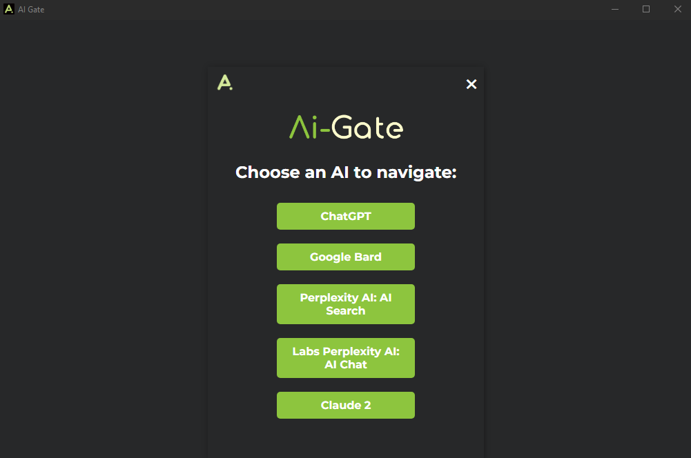

# <p align="center">My Project Platform-Vol.1


<p align="center">
  <a href="#">
    
  </a>
</p>


---


## <p align="center">🐬ปรีดิ์ปราโมทย์ เวชบุตร :  มิว🔰

### <p align="center">💖 พื้นที่เล็กๆ :  มิว
---

<p align="center">
  <a href="#">
    
  </a>
</p>

---


###  <p align="center">[ฉันพึ่งเริ่มเรียนรู้](https://learn.microsoft.com/en-us/users/wechabut/) ⬅️การรับรองนักเรียนของ Microsoft Learn


---

## <p align="center">🐬หากสนับสนุน ชานมเย็น ขนมปังอุ่นๆ 7-11 รับ desktop apps electronjs 


<p align="center">
  <a href="#">
    
  </a>
</p>


---


###  <p align="center">สำหรับข้อมูลเพิ่มเติมเกี่ยวกับโครงการ โปรดดูที่ [ABOUT.md](ABOUT.md).

 

### <p align="center">💖รายละเอียด desktop apps electronjs 

---


### ไฟล์เเละตัวเลือก เเบบ ที่ 1 จะมีไฟล์เดียว .exe รวม 5 AI,เเบบที่ 2 จะมีรายละเอียด ต่างๆ สำหรับ Dev.แตกไฟล์ออกมาจะมีขนาดใหญ่กว่าเเบบแรก

  

---


### ตัวเลือก 5 โปรแกรม ใช้งานพื้นฐานได้ฟรี


---

### ChatGPT


---

### @Bard AI


---

### Perp


---

### Perplexlabs


---

### Claude


---

### หากต้องการ API -perplexlabsapi


---

### รายละเอียด การสนันสนุน
 
```
ปรีดิ์ปราโมทย์ เวชบุตร ธนาคารกสิกรไทย เลขบัญชี 
```


---


### ฉันคือคนไทย

**1.** เพิ่ม คอมไพล์ .
 
```
git add . 
```

**2.** ให้สัญญา การเปลี่ยนแปลง ของคุณ .

```
git commit -m "ข้อความอธิบายการคอมมิต"
```

**3.** ผลักดัน 

```
git push origin main
```

**สไตล์ลิส ที่ต่างกัน**   เเทนที่ <your_branch_name> สาขาฟีเจอร์ ของคุณ

```
git push -u origin <your_branch_name>
```
<!--
